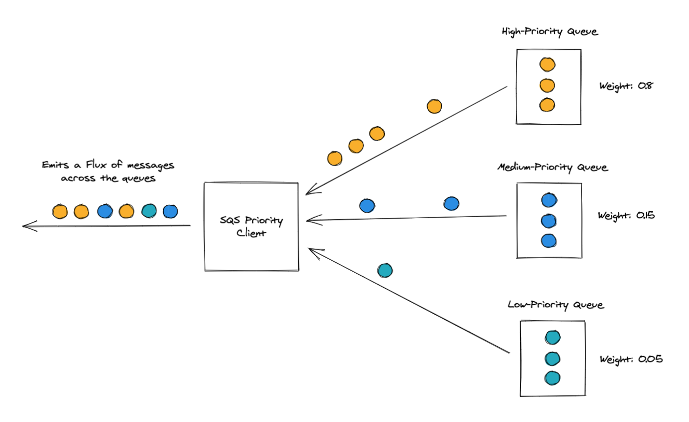

# example
Example of reading multiple Amazon SQS queues with weighted priorities using the sqs-priority-client.

## Building the Example
Run the following command to build the example application:

    ./gradlew clean build

## Running the Example
Run the following command to start the example application:

    ./gradlew :example:run